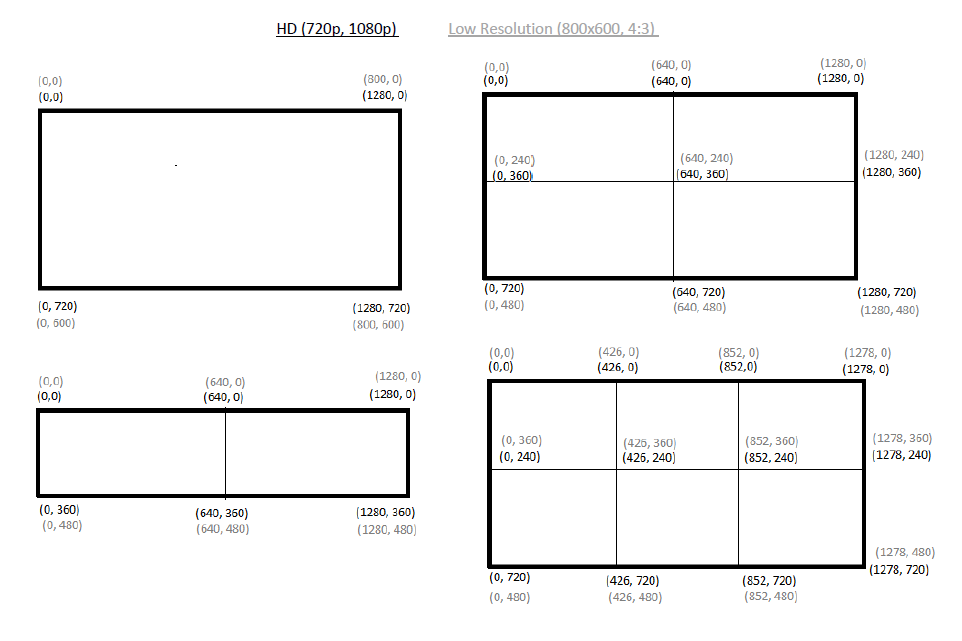

# BOVIDS
BOVIDS is an end-to-end deep learning based tool for posture estimation of ungulates in videos. It is the software presented and discussed in
>  t.b.a.
>  
>  t.b.a.
>  
Inside this contribution we explain the structure of BOVIDS and we highly recommend to read the methods section prior to the short instructions presented here as we assume that a potential user knows how the parts of BOVIDS interact with each other.

## License and citation
Re-use, distribution and modification as well as extending contributions under the GPL-3.0 License are highly welcome. If you use BOVIDS or parts of it, please consider citing the following publications:

BOVIDS software package and an application:
>  
>  
>  

Technical analysis of the deep learning prediction pipeline:
>  Hahn‐Klimroth, M, Kapetanopoulos, T, Gübert, J, Dierkes, PW. Deep learning‐based pose estimation for African ungulates in zoos. 
>  Ecol Evol. 2021; 00: 1– 18. https://doi.org/10.1002/ece3.7367 

## Installation
We suggest installing the necessary packages using anaconda as it will control the versions for you. 
>conda activate
>
>conda update conda anaconda
>
>conda create -n "bovids" python==3.8
>
>conda activate bovids
>
>conda install tensorflow-gpu==2.2 spyder keras openpyxl matplotlib tqdm pandas
>
>conda install -c conda-forge opencv efficientnet scikit-learn imgaug

If you are on linux, make sure to have the following packages installed.
> libgl1-mesa-glx libegl1-mesa libxrandr2 libxrandr2 libxss1 libxcursor1 libxcomposite1 libasound2 libxi6 libxtst6

Some parts of BOVIDS (i.e. if you want to use the tools for editing video files) require moviepy. As it is fairly likely to create a version clash between opencv, ffmpeg and moviepy, we suggest to create a different environment in that case. If not stated explicitely, the scripts provided by BOVIDS shall be run inside this bovids-environment.

>conda create -n "video" python==3.7
>
>conda activate video
>
>conda install spyder openpyxl matplotlib tqdm pandas
>
>conda install -c conda-forge moviepy opencv ffmpeg

Finally, the third party software (MIT license) [labelImg by tzutalin](https://github.com/tzutalin/labelImg) might be installed in a third environment. Detailed instructions can be found at the corresponding github repository.

## Data preparation and organisation

### Identifiers and organisation
BOVIDS requires a very specific data organisation to work flawless and comfortably. To this end, we suppose that we observe individuals of a specific **species** in multiple **zoos** in different **enclosures**. Each enclosure might be filmed by 1...n **video-streams** and, given a specific **date**, there are 1...m **individuals** in the enclosure. We suppose a date to have format YYYY-MM-DD and all names are not allowed to contain underscores. Then we define the following identifiers:

>*enclosurecode*: SPECIESNAME_ZOONAME_ENCLOSURENUMBER
>
>*individualcode*: SPECIESNAME_ZOONAME_INDIVIDUALNUMBER

If those identifiers are not unique over the all observation time, for instance, if video streams break or if individuals get stalled differently from time to time, the following identifiers are unique per night. A **night** is a collection of videos recording the same enclosure at a specific date with a starting time (standard 5 p.m.) and an ending time (standard 7 a.m.), these values are variable.

>*enclosureindividualcode*: SPECIESNAME_ZOONAME_ENCLOSURENUMBER_INDIVIDUALNUMBER1+INDIVIDUALNUMBER2+...+INDIVIDUALNUMBERM
>
>*enclosurevideocode*: SPECIESNAME_ZOONAME_ENCLOSURENUMBER\*VIDEONUMBER1+VIDEONUMBER2+...+VIDEONUMBERN

While this seems highly specific on the first glance, the system might be tricked to be used for free-range obervations as well. A species could then for instance be a localisation identifier, there is only one (virtual) enclosure and one videostream. 

#### video storage
Furthermore, BOVIDS requires the videos (.avi format, 1fps) to be stored according to the following scheme in which the path including DATA_STORAGE is variable:
DATA_STORAGE/SPECIESNAME/ZOONAME/Videos/SPECIES_VIDEONUMBER/YYYY-MM-DD_SPECIESNAME_ZOONAME_VIDEONUMBER.avi

Notice that the bitrate of 1fps is necessary in order to make BOVIDS work in the current version. The program code would need to be modified at just a few places to make BOVIDS work on videos with higher framerate.

#### annotation storage
There are two types of annotations. It will be explained in a later section how the necessary files can be created by BOVIDS.

##### action classification storage
First, there are annotations of the nights (video annotations) which are assumed to be created with [BORIS](http://www.boris.unito.it/), Version *xyz* :left_speech_bubble: in which the *observation list* is exported as an xlsx-file called **boris-file**. Those boris-files need to be stored as follows where again, DATA_STORAGE is variable. (*Auswertung and Boris-Dateien are german expressions for evaluation and boris-datafile, this can be easily adjusted inside the code or just be used as dummy expressions*)

DATA_STORAGE/Auswertung/SPECIESNAME/ZOONAME/Auswertung/BORIS_KI/Boris-Dateien/YYYY-MM-DD_ENCLOSURECODE.xlsx

BOVIDS contains a script *action_classification/preparation/boris_to_csv.py* to convert those xlsx-files into machine readable .csv files (called **boris-csv-files**) per individual per night. Those boris-csv-files need to be stored in 

DATA_STORAGE/Auswertung/SPECIESNAME/ZOONAME/Auswertung/BORIS_KI/csv-Dateien/YYYY-MM-DD_ENCLOSURECODE_SUM-7s_pred.csv 

##### object detection storage
The second type of annotations stems from the annotation of single images for training the object detector. These are single images and corresponding label files created by labelImg in the following structure in which again ANNOTATION_STORAGE is variable (*Bilder is the german word for pictures/images and can be easily adapted in the code*).

Images: ANNOTATION_STORAGE/Bilder/SPECIESNAME/ZOONAME/ENCLOSURENUMBER/imagename.jpg

Corresponding Labels: ANNOTATION_STORAGE/Label/SPECIESNAME/ZOONAME/ENCLOSURENUMBER/imagename.xml

## Data collection

### Convert video files
If the LUPUS system is used for recording, BOVIDS provides a handy converting option from the produced .asf-files ordered by channel into above's discussed structure using *data_collection/ConvertVideos.py*. If other recording systems are used, the .avi video files need to be created manually.  

#### Repair video files
It might happen that due to short drops in voltage a night consists of various parts or there are short sequences missing during a night. In order to make a realistic pose estimation over the whole observation time we need to make sure that all videos start and end at a known daytime and have a bitrate of 1fps. BOVIDS provides with *data_collection/video_processing.py* a collection of functions to concatenate multiple parts, to reduce the bitrate to 1fps and to fill in sequences of black frames into a video if some short sequences are missing. This program needs to be run in the video environment.

## Action classification
### Preparation
#### Annotate the video files with BORIS
In order to generate an initial training set, some nights need to be manually labelled and we propose to use BORIS (see action classification storage). It might be helpful to merge various video streams side to side in one video stream if many nights / enclosures / individuals shall be annotated at once. To this end, BOVIDS provides *action_classification/preparation/merge_video_files.py* which needs to be run in the video environment. Recall that the **boris-files** (.xlsx) need to be converted into **boris-csv-files** as described above. 

### Training of an initial network
#### Prepare a training-csv file
A so-called **training-csv-file** is a comma-separated text-csv with headers "date", "species", "enclosure number", "video numbers", "individual numbers", each line contains one night of a specific enclosure to which a boris-csv-file as an annotation exists and whose data should be part of the training set. Recall that date has the form YYYY-MM-DD, the enclosure number is one integer and videonumbers and individualnumbers are either an integer or a concatenation like 1;3;4 (meaning that video with number 1, with number 3 and with number 4 will be cut next to each other and used as one stream to the enclosure). Those .csv-files can be conveniently created with OpenOffice/LibreOffice. An example can be found in *action_classification/training/example_training_file.csv*. TODO: example :left_speech_bubble:

#### Create a balanced training set
Based on the previously created csv-trainings-file, *action_classification/training/generate_training_images.py* contains the functionality to produce balanced training images for both action classification streams (single frame and four-frame encoded). Recall that, before running the script,  well-trained object detectors are necessary. The output are folders containing images of classes 0 (standing), 1 (lying - head up) and 2 (lying - head down). Of course, BOVIDS can be used for estimating any three poses independently of the name. The code is furthermore straight forward to generalise to a different number of classes, but some programming is necessary.

#### Data preparation and validation split
BOVIDS provides some functions for preparing the necessary datasets for the total and the binary classification task in *action_classification/training/prepare_data_ac.py*. More precisely, images from different training sets (thus, folders containing 0/, 1/, 2/) can be merged, single classes can be randomly upsampled if the data is not sufficiently balanced and different classes can be merged. Furthermore, it provides the functionality to randomly select a subset of images as a validation set. At this point, a user should have 8 folders in total:
**multiple_frame_total:** train, validation
**multiple_frame_binary:** train, validation
**single_frame_total:** train, validation
**single_frame_binary:** train, validation

#### Training of the action classifiers
Use *action_classification/training/training_efficientnet.py* in order to train the four necessary action classifiers. It is possible to either finetune existing networks (input a compatible .h5 file as model weights) or to train on imagenet weights (choose 'imagenet' as model weights). Of course, the batch size and the number of epochs can be adjusted. BOVIDS does not support multiple gpu models, therefore, if multiple gpus are present, select which gpu shall be used. It is possible to train different networks on different gpus in parallel.

### Offline hard example mining
Once first versions of the action classifiers are trained, those can be used to generate a uniformly distributed training set for the final classifiers. Therefore, multiple nights should be predicted (see below) and the outcome can be used to evaluate the action classifiers. Furthermore, it can be used to generate automatically an almost balanced training set over the whole observation time without too much manual work load.

#### Evaluate the prediction
*action_classification/ohem/hard_example_mining_efficientnet.py* selects based on the prediction a uniformly at random chosen subset of images (single frame and multiple frame) with their corresponding labels (of the current action classifier). It is possible to choose whether uniformly at random sampled images should be drawn or if explicitely **hard examples** should be minded. Hard examples are images refering to time-intervals in which the predictions of the single frame and multiple frame action classifiers are not coherent. 

Now, *action_classification/ohem/efficientnet_evaluate_examples.py* can be used to display the single-frame and multiple-frame images next to each other and show the prediction given through the prediction system as a color code. A user can now give his own label. 

:left_speech_bubble: IMAGE EXAMPLE!!!

#### Retrain the action classifiers
In the end, the script can be used to extract statistical values like the accuracy and, more importantly, to move the images to their real classes. Therefore, we are left with a (not necessarily strictly balanced) set of images stemming from the whole observation time - an almost perfect training set. This training set is now used to fine-tune the previous action classifiers (like in the training step described above).

## Object detection

### Preparation
In a first step, *object_detection/preparation/create_annotation_images.py* provides the funcitonality to cut out single frames equally distributed over various nights. Those single images are then annotated manually with [labelImg by tzutalin](https://github.com/tzutalin/labelImg), take care that the labels coincide with the individualcodes and take care that the labels are stored in the PASCAL_VOC style.

It is suggested to save the images in the structure described above (object detection storage).

### Training
In the end, the training script of the object detector *object_detection/training/training_yolov4.py* BOVIDS requires all images that should be part of the training and validation set in one folder and a .txt-file containing the annotations. 

#### Generating the training set
BOVIDS provides *object_detection/training/prepare_data_od.py* which contains functions to create such a folder out of the previously described structure. It can be used to merge the data of various enclosures (for instance, if an object detector for many enclosures that only contain one individual each needs to be trained). Further, it is possible to rename the labels that were previously given. Once all images and, respectively, labels, are stored inside the required structure, *object_detection/training/training_yolov4.py* is be used to create the required label-text file. 

#### Training of an initial object detector
The same script is then used to train an object detector. Take care of the model weights, if no valid weights are presented, it will transfer learn on imagenet weights. Transfer-learning from previously trained models is only possible if the number of classes (thus, the number of individuals that need to be distinguished) coincides.

### Offline hard example mining

#### Generation of automatically generated labels
Once a designated object detector is trained, this object detector needs to be evaluated and, if necessary, finetuned. To this end, *object_detection/ohem/generate_annotation_files.py* can be used to extract images from a given set of nights and to apply the designated object detectors to create automatically generated label files. As an input, the script requires the same kind of .csv-files as described earlier (the so-called *training-csv-files*). We suggest to sample images from multiple videos, equally distributed over the observation period in order to make sure that varying light conditions or camera angles become negligible.

#### Evaluation of those labels
Similarily as in the action classification case, those labels can now be evaluated by *object_detection/ohem/evaluate_bounding_boxes.py*. This time, the user evaluates the bounding boxes drawn by the object detector as *good*, *medium*, *bad* and - if individuals need to be distinguished - *swapped*. Good images are those that could potentially be used for training a fine-tuned network. Medium are those images that are actually quite good but not optimal (like, a hoof is truncated or a part of an ear). If the quality is good enough (say, less then 5% of the bounding boxes are bad and at least 50% are good), then the network can be already used (those numbers clearly depend on the actual data and should not be taken as granted). The same python script is now used to store the good and bad images and their corresponding labels such that the bad images can now be manually annotated again (see above).

#### Re-training the network
After manual re-annotation, *object_detection/training/prepare_data_od.py* is used to create a new dataset out of the old labels, the good labels and the freshly annotated labels and images. Now, the network is trained again as described above. In principle, the whole procedure can be iterated until the quality is sufficiently high.

## Data prediction and evaluation
The prediction pipeline is controlled by three scripts, namely *global/global_configuration.py*, *prediction/predict_csv.py*, *prediction/configuration.py*. The content of the global configuration is explained below, basically, it gives the possibility to store global information like the path to an object detector used for a specific enclosurecode and similar information. The local file *prediction/configuration.py* is used to configure the storage of the videos and the storage of the files that are created by BOVIDS per night.

### Truncation
As the classification of images suffering from severe truncation effects is fairly difficult, BOVIDS provides a "truncation" parameter that allows to withdraw bounding boxes very close to the image border. To this end, for each night that should be predicted by BOVIDS, the user can define four boundaries (pixel from top and from left) such that bounding boxes being completely inside those regions are treated differently: one can choose in the global configuration file (see below) which behaviour class will be given to those images (standard: out of view) if the truncation phase is short, medium or long. Depending on the number of video streams and their resolution, the coordinates of the bounding boxes need to be adjusted, see the following figure:

### Prediction

### Evaluation

### Presentation

## (global) configuration

### Storage of networks

### Adding black regions

### Ordering video frames

### 

## Acknowledgement
The yolov4 implementation of BOVIDS is based on the implementation by [taipingeric](https://github.com/taipingeric/yolo-v4-tf.keras). 

