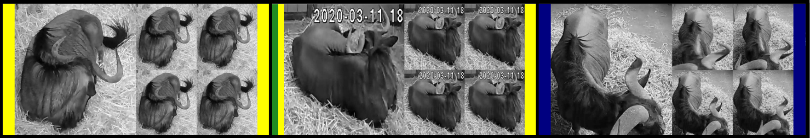
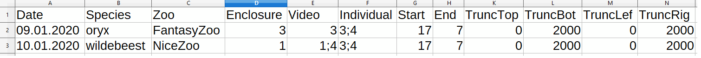

# BOVIDS
BOVIDS is an end-to-end deep learning based tool for posture estimation of ungulates in videos. It is the software presented and discussed in
> Gübert, J., Hahn-Klimroth, M., & Dierkes, P. W. (2022). BOVIDS: A deep learning-based software package for pose estimation to evaluate nightly behavior and > its application to common elands (Tragelaphus oryx) in zoos. Ecology and Evolution, 12, e8701. https://doi.org/10.1002/ece3.8701 
Inside this contribution we explain the structure of BOVIDS and we highly recommend to read the methods section prior to the short instructions presented here as we assume that a potential user knows how the parts of BOVIDS interact with each other.

## License and citation
Re-use, distribution and modification as well as extending contributions under the GPL-3.0 License are highly welcome. The whole bibliography *global/yolo-v4-tf.keras-master/*, based on the implementation by [taipingeric](https://github.com/taipingeric/yolo-v4-tf.keras) is avaiable under the MIT License. 

If you use BOVIDS or parts of it, please consider citing the following publications:

BOVIDS software package and an application:
> Gübert, J., Hahn-Klimroth, M., & Dierkes, P. W. (2022). BOVIDS: A deep learning-based software package for pose estimation to evaluate nightly behavior and > its application to common elands (Tragelaphus oryx) in zoos. Ecology and Evolution, 12, e8701. https://doi.org/10.1002/ece3.8701 

Technical analysis of the deep learning prediction pipeline:
>  Hahn‐Klimroth, M, Kapetanopoulos, T, Gübert, J, Dierkes, PW. Deep learning‐based pose estimation for African ungulates in zoos. 
>  Ecol Evol. 2021; 11: 6015– 6032. https://doi.org/10.1002/ece3.7367

## Installation
We suggest installing the necessary packages using anaconda as it will control the versions for you. 
>conda activate
>
>conda update conda anaconda
>
>conda create -n "bovids" python==3.8
>
>conda activate bovids
>
>conda install tensorflow-gpu==2.2 spyder keras openpyxl matplotlib tqdm pandas
>
>conda install -c conda-forge opencv efficientnet scikit-learn imgaug

If you are on linux, make sure to have the following packages installed.
> libgl1-mesa-glx libegl1-mesa libxrandr2 libxrandr2 libxss1 libxcursor1 libxcomposite1 libasound2 libxi6 libxtst6

Some parts of BOVIDS (i.e. if you want to use the tools for editing video files) require moviepy. As it is fairly likely to create a version clash between opencv, ffmpeg and moviepy, we suggest to create a different environment in that case. If not stated explicitely, the scripts provided by BOVIDS shall be run inside the bovids-environment.

>conda create -n "video" python==3.7
>
>conda activate video
>
>conda install spyder openpyxl matplotlib tqdm pandas
>
>conda install -c conda-forge moviepy opencv ffmpeg

Finally, the third party software (MIT license) [labelImg by tzutalin](https://github.com/tzutalin/labelImg) might be installed in a third environment. Detailed instructions can be found at the corresponding github repository.

## Data preparation and organisation

### Identifiers and organisation
BOVIDS requires a very specific data organisation to work flawless and comfortably. To this end, we suppose that we observe individuals of a specific **species** in multiple **zoos** in different **enclosures**. Each enclosure might be filmed by 1...n **video-streams** and, given a specific **date**, there are 1...m **individuals** in the enclosure. We suppose a date to have format YYYY-MM-DD and all names are not allowed to contain underscores. Then we define the following identifiers:

>*enclosurecode*: SPECIESNAME_ZOONAME_ENCLOSURENUMBER
>
>*individualcode*: SPECIESNAME_ZOONAME_INDIVIDUALNUMBER

If those identifiers are not unique over the all observation time, for instance, if video streams break or if individuals get stalled differently from time to time, the following identifiers are unique per night. A **night** is a collection of videos recording the same enclosure at a specific date with a starting time (standard 5 p.m.) and an ending time (standard 7 a.m.), these values are variable.

>*enclosureindividualcode*: SPECIESNAME_ZOONAME_ENCLOSURENUMBER_INDIVIDUALNUMBER1+INDIVIDUALNUMBER2+...+INDIVIDUALNUMBERM
>
>*enclosurevideocode*: SPECIESNAME_ZOONAME_ENCLOSURENUMBER\*VIDEONUMBER1+VIDEONUMBER2+...+VIDEONUMBERN

While this seems highly specific on the first glance, the system might be tricked to be used for free-range obervations as well. A species could then for instance be a localisation identifier, there is only one (virtual) enclosure and one videostream. 

#### video storage
Furthermore, BOVIDS requires the videos (.avi format, 1fps) to be stored according to the following scheme in which the path including DATA_STORAGE is variable:
DATA_STORAGE/SPECIESNAME/ZOONAME/Videos/SPECIES_VIDEONUMBER/YYYY-MM-DD_SPECIESNAME_ZOONAME_VIDEONUMBER.avi

Notice that the bitrate of 1fps is necessary in order to make BOVIDS work in the current version. The program code would need to be modified at just a few places to make BOVIDS work on videos with higher framerate.

#### annotation storage
There are two types of annotations. It will be explained in a later section how the necessary files can be created by BOVIDS.

##### action classification storage
First, there are annotations of the nights (video annotations) which are assumed to be created with [BORIS](http://www.boris.unito.it/), Version 7.7.3 in which the *observation list* is exported as an xlsx-file called **boris-file**. Those boris-files need to be stored as follows where again, DATA_STORAGE is variable. (*Auswertung and Boris-Dateien are german expressions for evaluation and boris-datafile, this can be easily adjusted inside the code or just be used as dummy expressions*)

DATA_STORAGE/Auswertung/SPECIESNAME/ZOONAME/Auswertung/BORIS_KI/Boris-Dateien/YYYY-MM-DD_ENCLOSURECODE.xlsx

BOVIDS contains a script *action_classification/preparation/boris_to_csv.py* to convert those xlsx-files into machine readable .csv files (called **boris-csv-files**) per individual per night. Those boris-csv-files need to be stored in 

DATA_STORAGE/Auswertung/SPECIESNAME/ZOONAME/Auswertung/BORIS_KI/csv-Dateien/YYYY-MM-DD_ENCLOSURECODE_SUM-7s_pred.csv 

##### object detection storage
The second type of annotations stems from the annotation of single images for training the object detector. These are single images and corresponding label files created by labelImg in the following structure in which again ANNOTATION_STORAGE is variable (*Bilder is the german word for pictures/images and can be easily adapted in the code*).

Images: ANNOTATION_STORAGE/Bilder/SPECIESNAME/ZOONAME/ENCLOSURENUMBER/imagename.jpg

Corresponding Labels: ANNOTATION_STORAGE/Label/SPECIESNAME/ZOONAME/ENCLOSURENUMBER/imagename.xml

## Data collection

### Convert video files
If the LUPUS system is used for recording, BOVIDS provides a handy converting option from the produced .asf-files ordered by channel into above's discussed structure using *data_collection/ConvertVideos.py*. If other recording systems are used, the .avi video files need to be created manually.  

#### Repair video files
It might happen that due to short drops in voltage a night consists of various parts or there are short sequences missing during a night. In order to make a realistic pose estimation over the whole observation time we need to make sure that all videos start and end at a known daytime and have a bitrate of 1fps. BOVIDS provides with *data_collection/video_processing.py* a collection of functions to concatenate multiple parts, to reduce the bitrate to 1fps and to fill in sequences of black frames into a video if some short sequences are missing. This program needs to be run in the video environment.

## Object detection

### Preparation

In a first step, *object_detection/preparation/create_annotation_images.py* provides the funcitonality to cut out single frames equally distributed over various nights. Those single images are then annotated manually with [labelImg by tzutalin](https://github.com/tzutalin/labelImg), take care that the labels coincide with the individualcodes and take care that the labels are stored in the PASCAL_VOC style.

It is suggested to save the images in the structure described above (object detection storage).

### Training
In the end, the training script of the object detector *object_detection/training/training_yolov4.py* BOVIDS requires all images that should be part of the training and validation set in one folder and a .txt-file containing the annotations. 

#### Generating the training set
BOVIDS provides *object_detection/training/prepare_data_od.py* which contains functions to create such a folder out of the previously described structure. It can be used to merge the data of various enclosures (for instance, if an object detector for many enclosures that only contain one individual each needs to be trained). Further, it is possible to rename the labels that were previously given. Once all images and, respectively, labels, are stored inside the required structure, *object_detection/training/training_yolov4.py* is be used to create the required label-text file. 

#### Training of an initial object detector
The same script is then used to train an object detector. Take care of the model weights, if no valid weights are presented, it will transfer learn on imagenet weights. Transfer-learning from previously trained models is only possible if the number of classes (thus, the number of individuals that need to be distinguished) coincides.

### Offline hard example mining

#### Prepare a training-csv file
A so-called **training-csv-file** is a comma-separated text-csv with headers "date", "species", "enclosure number", "video numbers", "individual numbers", each line contains one night of a specific enclosure to which a boris-csv-file as an annotation exists and whose data should be part of the training set. Recall that date has the form YYYY-MM-DD, the enclosure number is one integer and videonumbers and individualnumbers are either an integer or a concatenation like 1;3;4 (meaning that video with number 1, with number 3 and with number 4 will be cut next to each other and used as one stream to the enclosure). Those .csv-files can be conveniently created with OpenOffice/LibreOffice. An example can be found in *examples/training_file.csv*. 

#### Generation of automatically generated labels
Once a designated object detector is trained, this object detector needs to be evaluated and, if necessary, finetuned. To this end, *object_detection/ohem/generate_annotation_files.py* can be used to extract images from a given set of nights and to apply the designated object detectors to create automatically generated label files. As an input, the script requires the same kind of .csv-files as described earlier (the so-called *training-csv-files*). We suggest to sample images from multiple videos, equally distributed over the observation period in order to make sure that varying light conditions or camera angles become negligible.

#### Evaluation of those labels
Similarily as in the action classification case, those labels can now be evaluated by *object_detection/ohem/evaluate_bounding_boxes.py*. This time, the user evaluates the bounding boxes drawn by the object detector as *good*, *medium*, *bad* and - if individuals need to be distinguished - *swapped*. Good images are those that could potentially be used for training a fine-tuned network. Medium are those images that are actually quite good but not optimal (like, a hoof is truncated or a part of an ear). If the quality is good enough (say, less then 5% of the bounding boxes are bad and at least 50% are good), then the network can be already used (those numbers clearly depend on the actual data and should not be taken as granted). The same python script is now used to store the good and bad images and their corresponding labels such that the bad images can now be manually annotated again (see above).

(From left to right: Good bounding boxes in which individuals were detected correctly and the bounding boxes are drawn smoothely (green), mediocre bounding boxen in which individuals were detected correctly but the boxes are not optimal but almost (yellow), bad bounding boxes if one individual is, for instance, not found or only small parts of an individual are detected (bad) and finally, swapped bounding boxes in which individuals are misclassified.)

#### Re-training the network
After manual re-annotation, *object_detection/training/prepare_data_od.py* is used to create a new dataset out of the old labels, the good labels and the freshly annotated labels and images. Now, the network is trained again as described above. In principle, the whole procedure can be iterated until the quality is sufficiently high.

## Action classification
### Preparation
#### Annotate the video files with BORIS
In order to generate an initial training set, some nights need to be manually labelled and we propose to use BORIS (see action classification storage). It might be helpful to merge various video streams side to side in one video stream if many nights / enclosures / individuals shall be annotated at once. To this end, BOVIDS provides *action_classification/preparation/merge_video_files.py* which needs to be run in the video environment. Recall that the **boris-files** (.xlsx) need to be converted into **boris-csv-files** as described above. 

### Training of an initial network

#### Create a balanced training set
Based on the previously created csv-trainings-file, *action_classification/training/generate_training_images.py* contains the functionality to produce balanced training images for both action classification streams (single frame and four-frame encoded). Recall that, before running the script,  well-trained object detectors are necessary. The output are folders containing images of classes 0 (standing), 1 (lying - head up) and 2 (lying - head down). Of course, BOVIDS can be used for estimating any three poses independently of the name. The code is furthermore straight forward to generalise to a different number of classes, but some programming is necessary.

#### Data preparation and validation split
BOVIDS provides some functions for preparing the necessary datasets for the total and the binary classification task in *action_classification/training/prepare_data_ac.py*. More precisely, images from different training sets (thus, folders containing 0/, 1/, 2/) can be merged, single classes can be randomly upsampled if the data is not sufficiently balanced and different classes can be merged. Furthermore, it provides the functionality to randomly select a subset of images as a validation set. At this point, a user should have 8 folders in total:
**multiple_frame_total:** train, validation
**multiple_frame_binary:** train, validation
**single_frame_total:** train, validation
**single_frame_binary:** train, validation

#### Training of the action classifiers
Use *action_classification/training/training_efficientnet.py* in order to train the four necessary action classifiers. It is possible to either finetune existing networks (input a compatible .h5 file as model weights) or to train on imagenet weights (choose 'imagenet' as model weights). Of course, the batch size and the number of epochs can be adjusted. BOVIDS does not support multiple gpu models, therefore, if multiple gpus are present, select which gpu shall be used. It is possible to train different networks on different gpus in parallel.

### Offline hard example mining
Once first versions of the action classifiers are trained, those can be used to generate a uniformly distributed training set for the final classifiers. Therefore, multiple nights should be predicted (see below) and the outcome can be used to evaluate the action classifiers. Furthermore, it can be used to generate automatically an almost balanced training set over the whole observation time without too much manual work load.

#### Evaluate the prediction
*action_classification/ohem/hard_example_mining_efficientnet.py* selects based on the prediction a uniformly at random chosen subset of images (single frame and multiple frame) with their corresponding labels (of the current action classifier). It is possible to choose whether uniformly at random sampled images should be drawn or if explicitely **hard examples** should be minded. Hard examples are images refering to time-intervals in which the predictions of the single frame and multiple frame action classifiers are not coherent. 

Now, *action_classification/ohem/efficientnet_evaluate_examples.py* can be used to display the single-frame and multiple-frame images next to each other and show the prediction given through the prediction system as a color code. A user can now give his own label. 

(Color codes exist for each activity class, on the l.h.s. the label by the single frame classifier can be found and on the r.h.s. the one by the multiple frame classifier. The inner color bars are the label given by the user.)

#### Retrain the action classifiers
In the end, the script can be used to extract statistical values like the accuracy and, more importantly, to move the images to their real classes. Therefore, we are left with a (not necessarily strictly balanced) set of images stemming from the whole observation time - an almost perfect training set. This training set is now used to fine-tune the previous action classifiers (like in the training step described above).

## Data prediction and evaluation
The prediction pipeline is controlled by three scripts, namely *global/global_configuration.py*, *prediction/predict_csv.py*, *prediction/configuration.py*. The content of the global configuration is explained below, basically, it gives the possibility to store global information like the path to an object detector used for a specific enclosurecode and similar information. The local file *prediction/configuration.py* is used to configure the storage of the videos and the storage of the files that are created by BOVIDS per night.

Before explaining the prediction itself, we explain a few of the hidden features of BOVIDS that are necessary in order to use the prediction pipeline. As already described, BOVIDS can take multiple video streams per enclosure and puts them automatically together. 

### Ordering video frames
Depending on the number of video streams and their resolution, the different input streams are put together differently (see figure). The counting of the streams is always from left to right, then from top to bot. If 3 or 5 streams are present, the 4th or 6th region will be a black frame.

The global_configuration.py contains the dictionary VIDEO_ORDER_PLACEMENT in which the keys are the enclosure_video_code or the enclosure_code and the values are a list of the video numbers of the corresponding streams ordering them by the desired occurrence. (example: 'oryx_fantasyzoo_2': [3, 1] would place videostream 3 first and videostream 1 second for this enclosure).

### Adding black regions
In this context, it is possible to add "black regions" onto the produced outcome, thus regions that are recorded by multiple streams or regions that partly record different enclosures. Adding those black regions carefully improves the quality of the prediction significantly as the object detector is more likely to identify the correct individuals, those regions are somehow *disabled* for BOVIDS. To this end, the global configuration file contains the dictionary VIDEO_BLACK_REGIONS whose keys are again the enclosure_video_code or the enclosure_code. The values are lists of numpy-arrays containing the coordinates of the polygons that will be drawn black.

A potential setting in which video streams were placed next to each other and certain regions were disabled can be found here.

### Truncation
As the classification of images suffering from severe truncation effects is fairly difficult, BOVIDS provides a "truncation" parameter that allows to withdraw bounding boxes very close to the image border. To this end, for each night that should be predicted by BOVIDS, the user can define four boundaries (pixel from top and from left) such that bounding boxes being completely inside those regions are treated differently: one can choose in the global configuration file (see below) which behaviour class will be given to those images (standard: out of view) if the truncation phase is short, medium or long. 

### Post-Processing rules
One very important feature of BOVIDS is the post-processing (see a detailed discussion in the publications). To put it short: depending on the species it might be very unrealistic to observe very short phases of a certain behaviour - in this case, it is well possible that such short phases are due to short misclassifications that can be corrected. The correct choice of the post-processing rules is highly delicate and will be discussed later in detail (--> paragraph *evaluation*). The global configuration contains a dictionary POST_PROCESSING_RULES (keys: name, values: dictionaries) defining the set of rules (multiple such sets can be stored and the desired one can be chosen during prediction). The rolling average entries define the order of the rolling averages, the other entries dismiss phases with length (time-intervals) up to the number given by the rules (for instance, AAALAA will be converted to AAAAAA if 'ALA' > 0.). We denote 'A = standing (active)', 'L = lying-head up (lying)' and 'S = lying - head down (rem sleep position)', 'O = out of view'. Finally, the truncation parameters can be found here as well. Finally, since version 1.1, the global configuration contains a dictionary PP_RULE_DICT in which the total processing rules and the binary processing rules per individual or species need to be written down.

### Storage and modification of the neural networks 
It is supposed that there are two different folders for the object detection networks and the action classification networks. Suppose, the paths are P(OD) and P(AC) respectively. The user might want to create a subfolder "binary" inside of P(AC) in order to distinguish between the total and the binary classification task. P(OD) and P(AC) need to be put into *prediction/configuration.py*, lines 84 and 83. Furthermore, line 82 contains DATA_STORAGE (the path to the video structure as discussed above).
Finally, *global/global_configuration.py* contains four dictionaries (BEHAVIOR_NETWORK_SINGLE_FRAME_GLOBAL_BINARY, BEHAVIOR_NETWORK_JOINT_GLOBAL_BINARY, BEHAVIOR_NETWORK_SINGLE_FRAME_GLOBAL, BEHAVIOR_NETWORK_JOINT_GLOBAL) containing the relative path to the action classification networks (starting from P(AC)). The keys of the dictionaries need to be an individual_code. The function *get_behaviornetwork()* can be modified if few standard networks shall be used for a broad class of different individuals. Similarily, BASE_OD_NETWORK_GLOBAL and OD_NETWORK_LABELS_GLOBAL contain the relative path starting from P(OD) to the object detection network and, respectively, the corresponding label file (.txt). Those values are indexed by either a species, a species_zoo-code, an enclosure_code or an enclosure_individual_code. *get_object_detection_network()* might be modified if required. In the context of choosing an object detection network, MIN_DETECTION_SCORE and IOU_THRESHOLD are indexed by an enclosure_code and contain the iou_threshold / minimum detection score during object detection. If an enclosure is missing in this dictionary, the standard values of iou = 0.5 and score = 0.95 are applied. We suggest to decrease iou and score if multiple individuals are present in one enclosure.

### Additional global parameters
*global/global_configuration.py* allows to modify the global starting time and ending time of a video. If, for instance, this is set to 17 and 07 (5 p.m. and 7 a.m.), then shorter videos (like 6 p.m. to 5 a.m.) are evaluated in such a way that the first hour and the last two hours are set to "out of view". 

### Prediction
To finally predict new nights, we require *prediction/predict_csv.py*, *prediction/configuration.py* and a prediction-csv file containing the information which nights should be predicted. Let us start with the latter. It is similar to the csv files discussed before but contains additional columns for the starting time and ending time, and the borders of truncated regions (as discussed earlier). If no truncation should be applied, top and left need to be set to zero and right as well as bottom to a large number (e.g. 2000). An example can be found here.

In *prediction/predict_csv.py*, variable INPUT_CSV_FILE contains the full path to the created prediction-csv file. Furthermore, five variables containing different paths need to be adjusted. Recall at this point that BOVIDS first cuts out single frames from the video files, then applies object detection and finally uses the action classifier. TMP_STORAGE_IMAGES is thought to be a temporary data storage in which the images can be stored while TMP_STORAGE_CUTOUT contains the images after the object detection phase. **Make sure, that the temporary storage is large enough for the images of all your video files conducted in the prediction step!** As the object detection part is the most time-consuming part, BOVIDS provides the functionality to store the temporary cut-out images (FINAL_STORAGE_CUTOUT) such that they can, in principle, be used again. Further, those images can be used to check whether object detection (and later, action classification) work well. Finally, in 
FINAL_STORAGE_PREDICTION_FILES, stores .xslx files, images and .csv files that contain the actual prediction per night, those files are presented later on. Last but not least, BOVIDS creates a logfile containing all written outputs of the console and saves it in the folder LOGGING_FILES. Here, and everywhere, make sure that your folder-path variables end with a "/", otherwise, BOVIDS will behave unexpected.

Furthermore, a user can configure which steps of the prediction process should be skipped. If, for instance, the cut-out images already exist and a new action classifier should be applied, then TMP_STORAGE_CUTOUT need to be set to the actual location of the present images and image creation and object detection can be skipped. Analogously, it might be tempting to try different post-processing rules, in that case only the post-processing step can be applied. Attention: the boolean variable False here means that a step is conducted, so that the standard configuration is: everything False.

* SKIP_IMAGE_CREATION: if True, no frames will be cut out of videos.                          
* SKIP_INDIVIDUAL_DETECTION: if True, object detection phase will be skipped.
* SKIP_BEHAVIOR_TOTAL_SF: if True, this part of action classification will be skipped.
* SKIP_BEHAVIOR_TOTAL_MF: if True, this part of action classification will be skipped.
* SKIP_BEHAVIOR_BINARY_SF: if True, this part of action classification will be skipped.
* SKIP_BEHAVIOR_BINARY_MF: if True, this part of action classification will be skipped.
* SKIP_MOVING_FILES: if True, the temporary files will not be moved to the final storage.
* SKIP_REMOVING_TEMPORARY_FILES: if True, the TMP_* folders will NOT be deleted. If False, they will be deleted.
* SKIP_PP_TOTAL: if True, this part of post-processing will be skipped.
* SKIP_PP_BINARY: if True, this part of post-processing will be skipped.
* SKIP_OD_DENSITY: if True, BOVIDS does not analyse what percentage of individuals could be successfully identified during object detection.

Please realise that the following requirements need to be satisfied:
* If action classification is conducted, TMP_STORAGE_CUTOUT needs to contain the corresponding images.
* if post-processing is applied, FINAL_STORAGE_PREDICTION_FILES needs the output generated by the action classification step (folder raw_csv), furthermore, FINAL_STORAGE_CUTOUT needs to contain the .txt documents containing the position of each bounding box created during object detection.

If the configuration is complete, save the document and open *prediction/predict_csv.py*. First, adjust the following variables.
* AI_LIBRARY_LOCAL: path to the folder prediction of this repository (e.g. '/home/user/bovids/prediction/')
* AI_LIBRARY_GLOBAL: path to the folder global of this repository (e.g. '/home/mnt/fancy_nas/bovids/global/')
* YOLO_LIBRARY: path to the yolov4 library of this repository (e.g. '/home/mnt/fancy_nas/bovids/global/yolo-v4-tf.keras-master/') 

If multiple GPUs are present, decide which GPU is used for prediction (multiple processes on different GPUs can be conducted in parallel) by setting GPU_TO_USE accordingly. If only one GPU is present, choose '0'. Save the document and run it (e.g. in the spyder console or via the terminal).

### Evaluation
As discussed in detail in the corresponding contributions, there are various possibilities to ensure accurate predictions and validate the current system. The first one corresponds to the object detector.
* od density
  * In FINAL_STORAGE_PREDICTION_FILES/species/zoo/individual/ we find an .xlsx sheet showing the percentage of detections per 30 minutes of a video. If this percentage is low, one needs to check if the animal is really out of view or if the object detector fails. 

Furthermore, one can compare the prediction of BOVIDS on the manually annotated videos. It is also fairly important to check whether misclassifications stem from poor choices of the neural networks or from a suboptimal choice of post-processing rules.
* post-processing check and accuracy
  * *evaluation/accuracy_pp_rules/main.py* is a small script that can be used to analyse the performance of the post-processing rules. It comes with *evaluation/accuracy_pp_rules/configuration.py* which contains similar variables as the global configuration (post-processing rules) and need to be modified in advance. The script allows to compare post-processed real data with not post-processed real data (COMPARE_REAL_WITH_REALPP = True) such that it is easy to measure the error occuring by dismissing short phases if a human labels the video (this is some kind of a sytematical error). 
  * Furthermore, it compares the prediction of BOVIDS with the real data and the post-processed real data (COMPARE_REAL_WITH_AI = True, COMPARE_REALPP_WITH_AI = True). For this, it requires the prediction of BOVIDS (FINAL_STORAGE_PREDICTION_FILES) as well as the manually annotated videos as a boris-csv file (as described above, *action classification storage*). It outputs an xlsx-file per individual containing the accuracy, f-score as well as the deviation of the number of phases per night. Furthermore, it shows a confusion matrix per night as well as phases which are misclassified and last at least 4 time-intervals (the number 4 can be easily adjusted by setting ERROR_TOLERANCE_INTERVALS to a different value).

A further possibility to first evaluate the performance of BOVIDS and second to get a first impression of the activity budget per night, is a graphical representation of the corresponding night.
* Those images will be automatically produced by BOVIDS during post-processing and can be found in FINAL_STORAGE_PREDICTION_FILES/species/zoo/individual/total/final/. It can be used to see whether the animal is out of view for long periods of time and if there is an unexpected flattering between activities. If so, and the user is not sure that the neural networks already perform very decently, such data might be suspicious and needs to be checked.
   

Finally, BOVIDS produces an xlsx-file per night (stored in FINAL_STORAGE_PREDICTION_FILES/species/zoo/individual/total/final/) with the final prediction as well as statistical key quantities (like the percentages found in the activity budget). This file contains also a sheet in which each phase (a subsequent series of time-intervals of the same activity) is listed. 
* The cut-out images stored in FINAL_STORAGE_CUTOUT/individual_code/yyyy-mm-dd/multiple_frame/ are named after the time-interval they are correspondent to (up to a shift of 1). One can easily scroll through such a folder and detect manually the moment an activity event ends and a new event starts. This can be compared with the phase list of the corresponding xlsx-file and one can check manually very fast how many errors appear on unseen data. Of course, this step is only conducted while figuring out if the neural networks (action classifiers) need more training data or if they are already decent and can be seen as a *randomized sampling check.*
 

### Presentation
There are two additional tools contained in BOVIDS that allow to present the data for one specific individual (*presentation/get_individual_overview.py*) and for multiple individuals of one species (*presentation/get_species_overview.py*) respectively. Both scripts require the structure provided by FINAL_STORAGE_PREDICTION_FILES as an input, furthermore, one can choose the individuals which will be contained in the merged data. While merging the data, the script allows to add certain columns of information (like an anonymised individual code or the kind of stabling) in order to make data analysis with standard statistic tools like R more accessible. Therefore, one needs to create an **individual_info.csv**-file first, an example can be found in *examples/*.

The individual info file has the columns Cod_long,	Cod_short,	Cod_ssn,	species,	age,	sex,	zoo,	stabling,	stable with the following meaning.
* Cod_long: individual code
* Cod_short: a probably used shorter (unique) version of the individual code
* Cod_ssn: individual code in scientific notation, i.e. this might be used to anonymise data
* species, age, sex, zoo: self-explaining
* stabling: how many individuals are in the corresponding enclosure?
* stable: are there different species in the same (larger) area that might effect the nightly behaviour?

Cod_long and Cod_ssn are necessary for the script to work, the other parameters are variable and can be adjusted just by creating a different csv-file providing the user a high degree of freedom.

Given this file and the predicted data by BOVIDS stored in FINAL_STORAGE_PREDICTION_FILES, both scripts represent the data as a graphic as follows:

They furthermore provide an xlsx-sheet containing the most important statistical key quantitites and some sheets that might be useful to work with in R / scikit-learn or SPSS.

## Acknowledgement
The yolov4 implementation of BOVIDS is based on the implementation by [taipingeric](https://github.com/taipingeric/yolo-v4-tf.keras). We added features like image augmentation and dealing with UTF-8 characters. Clearly, the whole bibliography *global/yolo-v4-tf.keras-master/* stays avaiable under the MIT License. 

Parts of the prediction pipeline themselves can already be found in one of [our prior repositories](https://github.com/Klimroth/Video-Action-Classifier-for-African-Ungulates-in-Zoos).

We gained great support during data collection from the directors, curators and keepers of the participating zoos: Königlicher Burgers Zoo Arnheim, Tierpark Berlin, Zoo Berlin, Zoo Vivarium Darmstadt, Zoo Dortmund, Zoo Duisburg, Zoo Frankfurt, Zoom Erlebniswelt Gelsenkirchen, Erlebnis-Zoo Hannover, Zoo Heidelberg, Kölner Zoo, Zoo Krefeld, Opel-Zoo Kronberg, Zoo Landau, Zoo Leipzig, Allwetterzoo Münster, Zoo Neuwied, Zoo Osnabrück, Zoo Schwerin, Der Grüne Zoo Wuppertal. 

